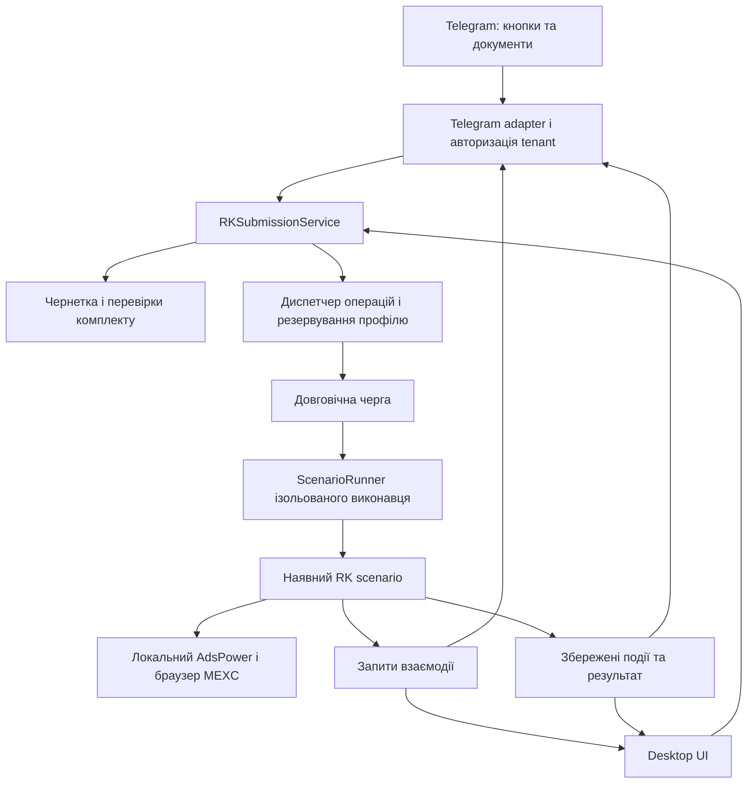

# Дистанційна подача MEXC Risk Control через Telegram

## Рекомендоване рішення

Ціль — серверний сервіс, яким користуються різні люди зі своїми акаунтами. Рекомендована архітектура: Telegram → сервер застосунку з ізоляцією користувачів → черга → ізольовані браузерні виконавці з AdsPower. Telegram відповідає за вибір власного акаунта, підготовку заявки, підтвердження запуску, прогрес і рішення під час зупинок. Наявний Selenium-сценарій AccountsManager виконує подачу через справжню форму MEXC.

TXT-експорт AdsPower корисний як один із каналів підключення профілю нового користувача. Він не є готовим дистанційним браузером і не замінює пакет документів РК. Основною моделлю варто розглянути доступ до повного профілю через підтримувані засоби AdsPower; TXT залишити альтернативою з явними перевірками неповних даних і авторизації.

Пропозиція передбачає два рівні дистанційної роботи:

1. Звичайні операції виконуються кнопками Telegram.
2. CAPTCHA та незнайомі екрани передаються власнику через доступ лише до його ізольованої браузерної сесії. Для користувацького сервісу доцільна короткочасна вебсесія ручного доступу; загальний RDP/VNC сервера непридатний для видачі всім клієнтам.

Визначені вимоги: серверне виконання; різні користувачі з власними акаунтами; профілі й потрібні доступи зберігаються на сервері. Для погодження залишаються спосіб підключення AdsPower, ручна допомога, правила передавання документів і очікувана одночасність. Конкретний провайдер, тариф чи технологія ізоляції ще не обрані.

## Межі й доказова база

Перевірка джерел виконана 9 вересня 2026 року. Проаналізовано 17 Markdown-документів у `docs`, наданий TXT і релевантні модулі поточної робочої копії. Старі архітектурні описи зіставлено з кодом і свіжими документами РК. Відомості про успішні попередні тести є даними локальної документації; нового запуску тестів або реальної подачі в межах цього дослідження не було.

Зовнішні висновки спираються на офіційні матеріали AdsPower, Telegram, aiogram, MEXC, Tailscale і noVNC. Пропоновані модулі, стани, правила черги та сценарії нижче є інженерними рекомендаціями. Вони не описують уже реалізовану Telegram-функціональність.

Неможливо наперед перелічити кожен майбутній екран MEXC чи збій інфраструктури. Практична мета — покрити відомі класи ситуацій і визначити безпечну поведінку для невідомого стану: зупинитися, зберегти контекст, запросити конкретну дію, не оголошувати успіх без доказу.

## 1. Що фактично є в проєкті

| Компонент | Фактичний стан | Значення для Telegram |
|---|---|---|
| `bot/` | Лише два порожні `__init__.py` | Бот потребує реалізації |
| `docs/architecture.md` | Описує handlers і CAPTCHA relay, яких немає в коді | Не можна оцінювати готовність за цим документом |
| `main.py` | Запускає desktop `App` і Tk main loop | Незалежного режиму виконавця ще немає |
| `SubmitMexcRiskControlScenario` | Є окремий сценарій з checkpoints | Повторно використати |
| `rk_documents`, `rk_dropdown`, `rk_email`, `rk_submission` | Розділені обов’язки браузерної автоматизації | Не дублювати в Telegram handlers |
| `rk_submission_files.py` | Пошук PDF та PNG/JPG/JPEG, перевірки файлів | Основа спільного підготування заявки |
| `rk_submission_journal.py` | Локальний запис `pending/unknown/rejected/submitted` | Зберегти захист від невідомого результату |
| `TaskService` | Задачі, події, поточний етап, відновлення перерваних задач як unknown | Розширити, а не створювати другу історію |
| `OperationControl` | Кооперативні pause/resume/cancel | Під’єднати через спільний сервіс |
| `ScenarioRunner` | ThreadPoolExecutor, типово два workers | Пул виконання, але не повноцінний диспетчер ресурсів |
| `ui/app.py::_run_submit_rk` | Перевірки, вибір файлів, підтвердження та конструювання сценарію | Перенести orchestration у сервіс |
| `ui/app.py::_submit_scenario_task` | Захист `_running_accounts`, створення задачі, callbacks | Захист має працювати незалежно від UI |
| `CaptchaService` | Лише повідомляє; людина вирішує CAPTCHA у браузері | Готового введення відповіді через Telegram немає |

У поточній документації зафіксовано 42 локальні RK-тести, включно з 18 Chrome DOM-тестами. Там же прямо зазначено, що останній варіант не підтверджено повною реальною подачею. Це важлива межа готовності: новий Telegram-транспорт не усуває браузерні невизначеності. Див. локальні джерела L1–L4.

### Конкретні місця, які треба змінити перед дистанційним запуском

**Бізнес-операція зараз збирається у вікні.** Виклик `_run_submit_rk` з Telegram залишив би залежність від вибраної вкладки, Tk-діалогів і `self.after`. Потрібний самостійний `RKSubmissionService`, який приймає явні дані акаунта й підготовленої заявки.

**Блокування живе в UI.** `_running_accounts` захищає лише запуски через відповідний об’єкт App. Бот повинен використовувати той самий централізований механізм резервування, а не свій окремий set.

**Пошук задачі обмежений останніми 100.** `TaskService._get_or_none` обходить `get_recent_tasks(limit=100)`. Для довгих операцій і старих Telegram-карток потрібний прямий запит задачі за ID. Інакше існуюча задача може перестати знаходитися після достатньої кількості нових запусків.

**Налаштування читаються в пам’ять і записуються JSON-файлом.** `SettingsManager` не є готовим багатопроцесним сховищем. Два незалежні процеси, які пишуть його одночасно, можуть затерти зміни. Першій версії достатньо одного власника запису; розділеним процесам потрібний явний протокол оновлення.

**Дані поки однокористувацькі.** `storage/database.py` задає глобально унікальний email, а задачі й події пов’язані з ним без tenant ID. Пошта й RK-налаштування також не розділені за клієнтом. Публічний бот поверх цих запитів не забезпечить ізоляцію. Потрібні власник кожного об’єкта, перевірки доступу й міграція зв’язків до стабільних ID.

**Ознака входу ще не доводить особу акаунта.** Переглянутий `ensure_mexc_logged_in` завершується, коли вхід не потрібний; там немає окремої перевірки UID поточної сесії. Перед завантаженням документів варто додати підтвердження очікуваного акаунта за доступним на сторінці надійним ідентифікатором. Наявність придатного UID/email-маркера слід перевірити окремим читанням реальної сторінки; вгадувати endpoint не потрібно.

## 2. Що містить наданий TXT

Файл `profiles_2026_09_09_12_00_44.txt` має розмір 19 394 байти. Це один блок профілю: 18 рядків `ключ=значення` та рядок-роздільник. Значення `cookie` — JSON-масив. Файл цілком не є JSON.

| Поле / група полів | Наявність | Практичне застосування |
|---|---|---|
| `acc_id`, `id` | Заповнені | Кандидати для зіставлення номера/ID з відповіддю AdsPower API |
| `name`, `remark` | Заповнені | Назва й опис для картки попереднього перегляду |
| `group`, `platform` | Порожні | Не дають повної класифікації профілю |
| `username`, `password`, `fakey` | Порожні | Немає готових облікових даних входу та 2FA |
| `cookie` | 74 cookies | Частина стану сайтів; 34 cookies доменів MEXC |
| `proxytype`, `ipchecker`, `proxy` | Заповнені | Налаштування підключення, які можна розібрати імпортером |
| `proxyurl` | Порожнє | URL оновлення проксі не надано |
| `proxyid`, `ip`, `countrycode` | Заповнені | Допоміжні відомості, не підтвердження поточної доступності |
| `ua` | Заповнене | User-Agent, але не повна конфігурація відбитка браузера |

Cookies розподілені між 19 доменними значеннями. Крім MEXC є дані інших сайтів. Значення cookies, адреси підключення та ідентифікатори акаунта у звіт не копіюються. Наявність cookies MEXC не доводить, що авторизація зараз дійсна або що всі ці cookies є авторизаційними. Джерело: L5.

AdsPower офіційно підтримує Excel і Text для експорту; TXT рекомендований, коли потрібно отримати довгий повний рядок cookies. Для штатного масового оновлення профілів ця сторінка описує повторний імпорт Excel. Отже, TXT слід трактувати як структуровані дані для власного адаптера, а не обіцяти взаємозамінність усіх режимів імпорту. [1](https://help.adspower.com/docs/Update-Profile-in-bulk)

### Що з файлу реально можна зробити

**Зіставити профіль.** Прочитати ідентифікатори, отримати список доступних профілів через API й перевірити відповідність. Назва або email не повинні бути єдиним ключем. Відповідність експортних `id/acc_id` полям API варто перевірити на цьому профілі, перш ніж зафіксувати її в імпортері.

**Підготувати частковий імпорт.** Перетворити проксі, UA, назву та cookies у підтримувані параметри створення профілю після перевірки поточної схеми AdsPower. Новий профіль матиме власну ідентичність; потрібне збережене зіставлення старого й нового ID. Порожні поля імпорту не повинні стирати пароль чи інші вже збережені дані.

**Допомогти міграції.** Використати експорт як додатковий інвентар або резерв частини параметрів. Він не містить PDF, скриншотів депозитів, доступу до пошти, текстів заяви, журналу попередньої подачі або всього браузерного сховища.

### Чого файл не гарантує

Імпорт cookies не гарантує збереження входу. Сесія могла завершитися або бути відкликана; сайту можуть бути потрібні інші дані браузера. За документацією AdsPower, cookies, Local Storage, IndexedDB та дані розширень є різними видами кешу. У цьому TXT відповідних повних сховищ немає. [2](https://help.adspower.com/docs/Cache-Data)

Імпорт UA не відновлює всі налаштування браузерного профілю. Крім того, чинність проксі та доступ до відповідної команди AdsPower не випливають із текстового файла.

**Висновок щодо TXT:** він придатний для допоміжної функції «Імпортувати/зіставити профіль», але робити його обов’язковим кроком кожної подачі РК недоцільно.

## 3. Порівняння архітектур

Оцінки складності відносні, не є кошторисом чи виміряним строком реалізації.

| Варіант | Де браузер | Коли доступний | Складність | Висновок |
|---|---|---|---|---|
| A. Бот у поточному застосунку | Поточний ПК | Поки працюють ПК, AdsPower і застосунок | Найнижча | Лише внутрішній технічний прототип |
| B. Самостійний виконавець на тому самому ПК | Поточний ПК | Поки працюють ПК, AdsPower і runtime | Помірна | Перевірка виділення логіки з UI |
| C. Бот на сервері, виконавець у клієнта | ПК користувача | Бот доступний незалежно; виконання залежить від ПК | Вища | Альтернатива, якщо доступи лишаються в клієнта |
| D. Backend і ізольовані серверні виконавці | Серверні VM/сесії | Незалежно від ПК користувачів | Вища | Рекомендований цільовий напрям |
| E. Telegram Mini App + виконавець | На вибраному хості | Залежить від backend і виконавця | Вища за звичайний бот | Розвиток UX після перевірки процесу |
| F. TXT → cookies → прямі HTTP-запити MEXC | Браузера може не бути | Не підтверджено для РК | Непередбачувана | Не рекомендовано як основний шлях |

### A/B. Поточний ПК і вихідне з’єднання до Telegram

Бот може отримувати команди через long polling. Для цього ПК сам звертається до Telegram; публічна адреса домашнього комп’ютера не потрібна. aiogram документує лише один polling-процес на токен. У межах одного ПК слід обрати єдиного власника бота. [3](https://docs.aiogram.dev/uk-ua/latest/dispatcher/long_polling.html)

Внутрішній прототип може працювати разом з desktop-застосунком. Саму прикладну логіку треба винести з App для серверного runtime. «Без UI AccountsManager» і «браузер у headless-режимі» — різні речі. Друге не є передумовою першого. A/B не є пропонованим кінцевим продуктом для різних користувачів.

Перевага — робота з уже підготовленими профілями й файлами. Обмеження — коли цей єдиний ПК вимкнений, бот не може сам повідомити про свою недоступність. Для незалежного повідомлення offline потрібний окремий завжди доступний компонент.

### C. Сервер керування і локальний виконавець

Сервер зберігає запити й картки операцій. Виконавець на ПК встановлює вихідне захищене з’єднання, отримує роботу та повертає події. AdsPower Local API лишається доступним локально для виконавця.

Для цього потрібні ідентифікація хоста, підтвердження прийняття роботи, строк придатності команди, heartbeat, відновлення після розриву та виключення подвійного виконання. Черга на сервері не робить вимкнений ПК здатним виконувати браузерну операцію.

При втраті heartbeat сервер не повинен одразу перепризначати вже розпочату подачу іншому виконавцю: старий процес може продовжувати працювати. Особливо після початку Submit результат переходить у перевірку, а не автоматичний повтор.

### D. Backend і серверні браузерні виконавці

Цей варіант звільняє комп’ютери користувачів від необхідності працювати постійно. На сервері мають бути доступні профілі, документи, tenant-налаштування та обраний спосіб отримання кодів. Backend і браузерні виконавці логічно розділяються, навіть якщо малий пілот розміщується на одній фізичній машині. Секрети передаються окремим захищеним механізмом, а не через репозиторій.

AdsPower Data Sync завантажує вибрані дані в хмару при закритті профілю. Перед перенесенням слід дочекатися синхронізації та перевірити відкриття на новому хості. Одночасний запуск того самого профілю на різних пристроях може порушувати синхронізацію; сама документація не рекомендує таку роботу. [4](https://help.adspower.com/docs/global_settings)

Profile Sharing — інший механізм: документація описує передавання профілю, але подальші дії в копіях не синхронізуються. Тому sharing не можна використовувати як заміну спільному живому керуванню однією сесією. Частина переданих даних залежить від їх наявності в хмарі. [5](https://help.adspower.com/docs/Profile_Sharing)

Windows-хост рекомендований як менша зміна від наявного середовища, а не як доведена єдина платформа. Перехід на Linux/headless потребує окремої перевірки браузера, завантажень документів і ручного доступу. Поточні локальні успіхи не доводять працездатність після logout, блокування сесії або перезавантаження сервера.

### E. Telegram Mini App

Mini App корисний для великого списку акаунтів, перегляду документів і складної форми підготовки. Він залишається клієнтом до backend: відкриття MEXC у мобільному WebView не означає роботу в AdsPower-профілі на ПК.

Telegram вимагає перевіряти `initData` на сервері; `initDataUnsafe` не є довіреним джерелом особи користувача. Також варто обмежувати давність авторизації. [6](https://core.telegram.org/bots/webapps#validating-data-received-via-the-mini-app)

Для першого RK-процесу кнопки бота мають нижчу вартість реалізації. Mini App слід обрати відразу лише якщо великі списки, складне комплектування документів або керування браузером усередині Telegram є обов’язковими вимогами.

### F. Прямий HTTP з cookies

У перевіреній публічній Spot API-документації MEXC не знайдено описаного endpoint подачі RK-документів. Коди помилок ризику й account flags не є документованим способом подати заяву або визначити її розгляд. Це висновок у межах перевіреної публічної документації, не твердження про відсутність внутрішніх API. [7](https://mexcdevelop.github.io/apidocs/spot_v3_en/)

Недокументований HTTP-шлях потребував би окремого доказу повного протоколу авторизації, завантажень, підтверджень і статусів. У поточному проєкті він замінив би готовий браузерний сценарій неперевіреною інтеграцією. Для першої версії підстав для такої заміни немає.

## 4. Серверний продукт для різних користувачів

### 4.1. Дві моделі довіри

| Модель | Що зберігає сервер | Перевага | Обмеження |
|---|---|---|---|
| Кероване серверне виконання | Профіль/доступ до нього, документи, погоджені облікові дані | Працює при вимкненому ПК клієнта | Сервіс відповідає за ізоляцію й збереження доступів |
| Сервер керує агентом клієнта | Команди, стани, мінімальні метадані | Доступи можуть залишатися у клієнта | Потрібні встановлений агент і ввімкнений ПК |

Обрана перша модель: профілі й потрібні доступи зберігаються на сервері. Друга наведена лише для порівняння і не входить у рекомендовану першу реалізацію. Перелік потрібних доступів визначається по функції: для подачі готового комплекту торгові API-ключі не потрібні; для наявного автоматичного входу потрібні відповідні облікові дані, для коду — поштовий доступ. Ручне введення коду може бути додатковою опцією з окремим адаптером.

### 4.2. Як підключати профілі користувачів

**Варіант 1: делегований доступ у команді AdsPower.** Клієнт надає доступ до потрібної групи профілів через підтримувані можливості команди. Документація AdsPower описує права на групи й окреме API-право для учасника; у кожного учасника є власний API key. Це дає основу делегування, але не готовий OAuth-конектор сервісу. Доступ, відкликання й запуск потрібної команди на виділеному виконавці слід перевірити технічним пілотом. [15](https://help.adspower.com/docs/members), [16](https://help.adspower.com/docs/api)

Один акаунт AdsPower може належати кільком командам; документація описує ізоляцію їхніх даних і окремі плани. Це не доводить, що один локальний AdsPower-процес одночасно обслуговуватиме всі команди через незалежні API-контексти. Не слід будувати виконання на неперевіреному перемиканні активної команди. Пілот — ізольований виконавець для одного контексту, потім перевірене масштабування. [17](https://help.adspower.com/docs/One-Account-Multiple-Teams)

**Варіант 2: Profile Sharing до серверного облікового запису.** Підходить, коли клієнт свідомо передає робочу копію профілю сервісу. Потрібно пояснити, що це не жива синхронізація подальших дій. Визначити, яка копія стає робочою для РК, як припиняється її використання й як повертається контроль. [5](https://help.adspower.com/docs/Profile_Sharing)

**Варіант 3: TXT-імпорт.** Клієнт завантажує файл, система показує його склад, створює чернетку підключення, перевіряє відсутні доступи, а потім створює/зіставляє профіль. Авторизацію й фактичний акаунт перевіряє браузер. Файл ніколи не запускає РК автоматично. Для наданого зразка окремо потрібні пароль/альтернативний login, механізм email-коду, документи та тексти.

Рекомендація: першим дослідним конектором зробити повний профіль через делегований доступ або свідомий sharing; TXT-імпорт — наступний конектор на тому самому інтерфейсі. Якщо користувачі переважно мають лише TXT, пріоритет можна змінити, прийнявши необхідність повторного входу й відсутніх даних.

Не підтверджено автоматизоване підключення будь-якої зовнішньої команди одним ключем, умови комерційного надання такого сервісу, остаточну тарифікацію місць і паралельних виконавців. Це конкретні питання для AdsPower до закупівлі, а не підстава обіцяти необмежений запуск усіх клієнтів на одній ліцензії.

### 4.3. Ізоляція даних і браузера

Кожен клієнт має tenant ID. До нього належать акаунти, прив’язки AdsPower, пошта, документи, налаштування РК, задачі, результати й ручні сесії. Telegram user ID визначає особу, але доступ до конкретного tenant визначає сервер. Переданий клієнтом `tenant_id` сам по собі не є дозволом.

Для backend рекомендовано PostgreSQL та репозиторії з обов’язковим tenant-контекстом. Row Level Security може бути додатковим захистом: PostgreSQL підтримує політики доступу до рядків, проте власник таблиці й привілейовані ролі можуть обходити їх. Прикладний процес не має працювати як superuser; RLS не замінює перевірку доступу до файлів, черги та remote session. [18](https://www.postgresql.org/docs/current/ddl-rowsecurity.html)

Браузерний профіль ізолює сайт-сесії, але не весь робочий стіл чи файлову систему виконавця. Якщо клієнт отримує ручний desktop-доступ, рекомендована сильна межа — окрема VM або інша перевірена ізольована сесія з документами лише його операції. Не видавати клієнту raw CDP, AdsPower API чи RDP спільної машини.

Перший серверний пілот повинен мати щонайменше двох тестових клієнтів із перевіркою взаємної недоступності даних. Це важливіше за запуск десятків браузерів: помилка tenant-ізоляції є функціональною несправністю продукту.

### 4.4. Пошта, налаштування та джерело депозитів

Поточні глобальні mailbox credentials і `icloud_ads_profile_id` не можна перенести як спільні ресурси всіх клієнтів. Кожен tenant має власну конфігурацію джерела депозитних доказів і пошти. Пропозиція — замінити змішану назву налаштування на явний зв’язок джерела доказів, з міграцією чинного значення власнику поточних даних.

Для email-коду є два продуктові режими: tenant-scoped поштовий доступ на сервері або введення поточного коду власником через окремий interaction. Другий режим потребує змін preflight, який зараз вимагає mailbox credentials. Він не дозволяє просто прибрати перевірку і вважати сценарій готовим.

PDF і докази мають належати вибраному акаунту. Якщо кошти надходили не з того основного MEXC-профілю, який використовує поточний сценарій скриншотів, треба дозволити власні справжні докази або окремий конектор джерела. Неможливо універсально побудувати підтвердження всіх депозитів клієнтів із withdrawal history одного адміністративного акаунта.

### 4.5. Ресурси й розгортання

Пропонований склад: один backend, PostgreSQL, приватне сховище документів, довговічна черга задач і пул браузерних виконавців. Черга може бути спочатку на БД; окремий брокер потрібний при обґрунтованому навантаженні. Backend можна розміщувати окремо від Windows-браузерів. Вибір вебфреймворку та брокера не є блокером для дослідження і ще не зафіксований.

AdsPower документує Windows, Ubuntu Desktop 22.04+ і headless/API-key запуск. Підтримка ОС не доводить сумісність поточного RK-сценарію з дешевим Linux VPS без графічного оточення. Для першого перенесення рекомендовано підтримуваний Windows-хост, а Linux перевірити окремим spike. Мінімальні 2 GB RAM із системних вимог не є оцінкою сервера з кількома браузерами. [16](https://help.adspower.com/docs/api), [19](https://help.adspower.com/docs/system_requirements)

Потужність обирається за виміряними піками RAM/CPU одного прогону, кількістю паралельних браузерів, витратами на ізольовані сесії й запасом для ОС. Очікування CAPTCHA також займає ресурс; потрібні ліміт очікування, справедлива черга між tenant і квота активних задач. Конкретну кількість профілів на сервері без вимірювання обіцяти не можна.

Модель вартості: backend + БД/диски/backup + браузерні VM + AdsPower-план/місця + проксі + трафік ручних сесій. Точний кошторис потребує кількості користувачів, активних профілів, одночасних РК і моделі ліцензії. Закупівля сервера до перевірки ручної сесії та AdsPower-доступу передчасна.

## 5. Як виглядатиме користування

### Головний екран

```text
AccountsManager
Виконавець: доступний
Активних операцій: 1

[Акаунти] [Операції]
[Підготувати РК] [Стан системи]
```

Пошук працює за відображуваною назвою та номером профілю. Усередині команди використовується стабільний ID акаунта/прив’язки. Пошук не повинен самостійно створювати або переприв’язувати акаунти.

### Перший вхід користувача

Після `/start` сервер створює або знаходить особу користувача. Далі — підключення профілю, перевірка прив’язки до MEXC, налаштування отримання коду й додавання документів. Лише після цього стає доступна підготовка РК. Імпортований profile ID не дає права привласнити вже підключений чужий профіль; конфлікт власності йде на окрему перевірку без розкриття даних іншого клієнта.

### Основний шлях: документи вже у сховищі користувача

1. Відкрити картку акаунта та натиснути «Підготувати РК».
2. Побачити перевірки: зв’язок із профілем, доступність виконавця, пароль, пошта, файли, налаштування, попередня спроба.
3. Вибрати PDF та один-два докази депозитів. Навіть якщо комплект один, показати його перед запуском.
4. Переглянути призначення файлів до розділів, категорії та обидва тексти пояснення.
5. Підтвердити конкретний комплект кнопкою «Подати заявку».
6. Отримати одну картку прогресу: відкриття → перевірка → документи → email-підтвердження → відправлення → результат.
7. За потреби відповісти на запит ручної допомоги.
8. Отримати точний результат: «Подано, очікує розгляду», «Відхилено під час подачі», «Не вдалося підтвердити результат» або конкретну причину зупинки.

Пропозиція: підтверджувати комплект до запуску браузерної подачі. Наявний сценарій після цього сам натискає кнопки форми, включно з її фінальним діалогом. Додаткове Telegram-підтвердження безпосередньо перед останнім кліком можливе, але створює нове очікування і ризик прострочення коду. Цей вибір треба погодити.

### Завантаження документів із телефону

Спочатку вибирається акаунт і розділ заявки, потім додається файл. Надісланий без контексту документ не можна автоматично прикріпити до останнього акаунта, особливо коли одночасно відкрито кілька чернеток.

Рекомендується приймати скриншоти як файли-документи, щоб зберегти оригінал. Для групи вкладень потрібна кнопка «Готово», після якої формується комплект. Кожен документ має власний ID, тип, розмір, хеш, власника та прив’язку до чернетки.

Стандартний Telegram Bot API обмежує завантаження ботом файла через `getFile` до 20 MB. Поточний локальний код РК відхиляє файли розміром від 10 MiB включно. Для цієї версії достатньо суворішого локального порогу; фактичне обмеження конкретної форми MEXC слід перечитати перед реалізацією. Збільшення ліміту Telegram не скасовує ліміту форми. [8](https://core.telegram.org/bots/api), L2.

Рекомендація щодо збереження: тимчасове завантаження → перевірка формату і цілісності → атомарне переміщення в кероване сховище. Перевіряти потрібно вміст, а не тільки розширення. Ім’я від користувача не повинно ставати довільним шляхом файлової системи.

### Якщо доказів депозиту ще немає

Передбачити два окремі шляхи: «Додати готовий документ» і «Підготувати через наявні сценарії». Другий використовує вже реалізовані пошук депозитів і скриншот withdrawal.

Тут є суттєва особливість: скриншот робиться в основному MEXC-профілі з налаштування `icloud_ads_profile_id`, а не у профілі цільового РК-акаунта. Дві задачі різних акаунтів можуть одночасно потребувати одного основного браузера. Тому резервування має бути за фактично використаним profile ID, а не лише email цільового акаунта. Джерело: L3.

На першому етапі можна обмежити запуск РК уже підготовленими файлами, а підготовку депозитів додати наступним окремим кроком. Це зміна обсягу продукту для погодження, а не приховане обмеження реалізації.

## 6. Ручна допомога, CAPTCHA та перевірка особи

### Рекомендація для першої версії

При ручному етапі Telegram показує причину, акаунт, актуальну задачу та дії «Відкрити мою сесію», «Перевірити стан», «Припинити». Людина працює в тому самому AdsPower-браузері через ізольовану сесію лише своєї задачі. Після повернення автоматизація перечитує стан сторінки; натискання «Продовжити» саме по собі не доводить, що проблему вирішено.

Для внутрішнього адміністрування один із варіантів — RDP через Tailscale, якщо редакція Windows підтримує RDP-хост. Документація називає Pro, Enterprise, Education і Windows Server; підключення через приватну мережу не потребує публічного port forwarding. Unattended-режим Tailscale забезпечує доступність його служби без входу користувача, але не запускає автоматично AccountsManager чи AdsPower. Клієнтам доступ до спільного адміністративного desktop не надається. [9](https://tailscale.com/docs/solutions/access-remote-desktops-using-windows-rdp), [10](https://tailscale.com/docs/how-to/run-unattended)

Потрібно перевірити, що обраний спосіб доступу відкриває потрібну Windows-сесію й не порушує роботу браузера при підключенні/відключенні. Конкретний remote desktop-продукт не обрано.

### Якщо все має залишатися всередині Telegram

Можна створити Mini App з ручним керуванням через noVNC або власний потік зображення браузера. noVNC — VNC-клієнт для браузера; йому потрібний серверний RFB/WebSocket-транспорт. Це окремий компонент, а не властивість Telegram-бота. [11](https://novnc.com/noVNC/docs/API.html)

Для продукту знадобляться авторизація сеансу, обмеження доступу до конкретної задачі, строк життя доступу, один активний оператор і явна передача керування між людиною та автоматизацією. Звичайний VNC робочого столу може показувати інші вікна й акаунти; для кількох операторів необхідна ізоляція сесій. Не слід видавати повний робочий стіл за ізольований доступ лише до одного профілю.

Власне керування screenshot + координати має додаткові складнощі: застарілий кадр, масштабування, прокрутка, drag, фокус, iframe, спливаючі вікна та затримки. Воно може бути наступною фазою, але не є найкоротшим шляхом до першої надійної подачі.

### Facial recognition

Telegram-бот не замінює перевірку особи, яку вимагає MEXC. Передавання зображення віддаленого екрана також не означає передавання камери телефону в браузер на ПК. Якщо конкретна форма пропонує офіційний перехід на телефон/QR, його можна дослідити окремо; наявність такого механізму саме в RK-процесі не підтверджено.

Збережений локальний Facescan-перемикач залишається поточним налаштуванням перевірки сценарію. Його вимкнення не змінює серверних вимог MEXC. У Telegram-картці потрібно показувати цей режим і не змінювати його непомітно. Офіційні матеріали MEXC описують подачу через портал, автентичні документи та окремий результат розгляду. [12](https://www.mexc.com/support/risk-control), L1.

## 7. Матриця ситуацій і поведінки

| Ситуація | Очікувана поведінка | Повтор |
|---|---|---|
| Неавторизований Telegram-користувач | Не показувати акаунти й документи | Немає |
| Команда з групи | Для першої версії використовувати приватні чати | У приватному чаті |
| Чужий account/task/document ID | Відхилити незалежно від коректності ID | Лише свій tenant |
| Користувач відкрив чужу remote-session URL | Відхилити серверною перевіркою особи й tenant | Не довіряти самому посиланню |
| Клієнт відкликав AdsPower/поштовий доступ | Припинити нові дії, зафіксувати етап | Повторне підключення |
| У різних користувачів однаковий email | Незалежні записи з власними ID | Без глобального злиття |
| Tenant заповнив чергу задачами | Застосувати квоту і справедливий порядок | Не блокувати інших |
| Відкликання доступу/видалення під час Submit | Зупинити подальші дії, зберегти мінімальний результат спроби | Не оголошувати відкликання заявки |
| Акаунт/профіль видалено | Показати застарілу прив’язку | Після виправлення |
| Однакова назва двох профілів | Запропонувати явний вибір з ID | Без автозіставлення |
| Профіль вручну відв’язано | Не відновлювати зв’язок автоматично | Окреме рішення |
| Сесія MEXC іншого акаунта | Зупинити до завантаження документів | Після перевірки особи сесії |
| AdsPower вимкнений / API недоступний | Зрозумілий стан виконавця | Після відновлення |
| API key або права некоректні | Повідомити про доступ, не маскувати як «немає профілів» | Після виправлення |
| Проксі не працює | Зупинка/запит рішення | Без автоматичної заміни IP |
| Профіль зайнятий іншою задачею | Показати власника блокування | Черга або пізніше |
| Основний профіль скриншотів зайнятий | Чекати резервування саме цього профілю | Без конкуренції вкладок |
| Немає пароля або пошти | Заблокувати запуск за поточними передумовами | Після заповнення |
| Немає PDF / доказів / тексту | Показати точний перелік | Лише явний погоджений override |
| Кілька PDF або більше двох зображень | Обов’язковий вибір | Не обирати випадково |
| Порожній, пошкоджений або завеликий файл | Відхилити до запуску | Після заміни |
| Той самий файл надіслано двічі | Показати дубль за хешем | Не множити вкладення |
| Файл змінився після підтвердження | Інвалідувати комплект або використати його незмінний snapshot | Нове підтвердження |
| Не вистачає диска / прав запису | Не запускати подачу без надійного журналу | Після усунення |
| Налаштування змінено після старту | Поточна задача використовує погоджений snapshot | Нові настройки для нової заявки |
| Подвійний клік «Подати» | Повернути існуючу задачу | Одне виконання |
| Telegram повторив update | Розпізнати вже прийняту команду | Не створювати дубль |
| Натиснута стара кнопка | Перевірити версію картки, дозволені дії та строк | Показати актуальну картку |
| ПК повернувся після довгого offline | Перевірити давність команди | Нове підтвердження простроченої |
| Сесія MEXC завершилася | Наявний login-flow | Обмежені штатні кроки |
| CAPTCHA | Очікування людини у тому самому браузері | Без сліпих перезапусків |
| Не пройдено KYC/facial requirement | Окремий стан вимоги MEXC | Після завершення вимоги |
| Форма РК недоступна | Повідомити саме про недоступність форми | Не заявляти «обмежень немає» |
| Уже є підтверджена заявка | Показати поточний результат | Не подавати дубль |
| Повільне завантаження / невідомий DOM | Bounded wait, діагностика, ручна допомога | Не вважати успіхом |
| MEXC-мережа впала до Submit | Запропонувати очікування/оновлення/зупинку | За політикою сценарію |
| Не прийшов email-код | Запит «чекати ще / припинити» | Обмежене очікування |
| Код явно відхилений | Наявний один retry свіжого коду | Лише для явної помилки коду |
| Документ явно відхилено | Зберегти причину MEXC | Заміна людиною, новий комплект |
| Пауза під час критичного кроку | «Призупиняю», потім безпечна межа | Не обіцяти миттєвість |
| Stop до зовнішнього надсилання | Скасування з фактичним станом | Окремий новий запуск |
| Stop/краш після початку Submit | Невідомий результат до перевірки | Заборонити автоповтор |
| Telegram недоступний, MEXC працює | Зберігати події й результат локально | Повторювати доставку, не подачу |
| Бот заблокований користувачем | Завершити локальний облік, позначити недоставлення | Без безкінечних спроб |
| Процес перезапущено | Відновити чернетки й історію, звірити незавершені спроби | Не воскресати сліпо з checkpoint |
| Закрито UI-вкладку | Не скасовувати бот-задачу через суто UI-подію | Явне керування задачею |
| Браузерна вкладка закрита | Зупинити сценарій, врахувати факт Submit | Не відкривати повторно для дубля |
| Два оператори відповіли на запит | Прийняти одну дозволену відповідь атомарно | Другому показати результат |
| Людина змінила форму вручну | Перечитати стан, перевірити комплект | Нове погодження при зміні змісту |
| Відмовив запис журналу після відправки | Залишити незавершений маркер спроби | Тільки перевірка результату |

Поведінка при втраті Telegram і поведінка при помилці MEXC — різні політики. Повтор доставки повідомлення нормальний; повтор зовнішньої подачі після втрати відповіді небезпечний. Наявне правило запитувати рішення при проблемах мережі MEXC слід зберегти до іншої вказівки.

## 8. Архітектура коду для підтримуваного продукту



### Пропоновані межі відповідальності

| Модуль / сервіс | Відповідальність |
|---|---|
| `runtime/bootstrap` | Створення клієнтів, сховищ і сервісів без обов’язкового Tk |
| `services/tenant_access` | Власники, учасники, права на кожен об’єкт |
| `services/profile_connections` | Делегування, sharing або TXT-імпорт через окремі адаптери |
| `services/executor_registry` | Ідентичність виконавця, його tenant-контекст і доступність |
| `services/rk_submission_service` | prepare/validate/confirm/start для РК |
| `services/operation_dispatcher` | Резервування, черга, start/pause/cancel і завершення |
| `services/interaction_service` | Запити рішення, TTL, відповідь, один переможець |
| `services/document_service` | Приймання, перевірка, snapshot і доступ до файлів |
| `services/notification_outbox` | Доставка збережених повідомлень із повтором |
| `bot/handlers/accounts` | Пошук і картка акаунта |
| `bot/handlers/rk` | Кроки підготовки й підтвердження |
| `bot/handlers/documents` | Прив’язка вкладення до чернетки |
| `bot/handlers/operations` | Картки задач, pause/resume/stop |
| `bot/auth`, `bot/callbacks` | Авторизація й перевірка актуальності дій |
| Наявні `automation/scenarios/rk_*` | Взаємодія з MEXC і доказ результату |

Це логічні межі, а не вимога відразу створювати кожен названий файл. Невеликі споріднені компоненти можна тримати разом, доки вони мають одну відповідальність. Не потрібні мікросервіси лише заради кількості модулів.

### Дані, які потрібно моделювати явно

**Чернетка РК:** ID, стабільний account ID, profile binding, автор, версія, вибрані document IDs, тексти, категорії, Facescan-налаштування, результати preflight, час підтвердження та хеш погодженого комплекту.

**Задача:** наявний task ID, джерело запуску, автор, executor ID, статус, поточний етап, причина очікування, посилання на чернетку. Email може залишатися відображуваним полем, але перейменування не повинно руйнувати історію.

**Спроба подачі:** attempt ID, task ID, погоджений комплект, ознака початку зовнішньої дії, локальний результат, доказ/час підтвердження. Стан розгляду документів зберігається окремо від стану виконання задачі.

**Запит взаємодії:** interaction ID, task ID, тип, дозволені відповіді, користувач/роль, строк, версія, хто й коли відповів. Старий callback не повинен відповідати на нову CAPTCHA або нову спробу.

**Документ:** керований шлях, хеш, тип, розмір, власник, призначення. Однаковий PDF для адреси та професійної інформації допустимий технічно за нинішнім процесом, але його відповідність обом вимогам переглядається в комплекті.

Для desktop-прототипу можна залишити SQLite з атомарними транзакціями. Для цільового серверного backend рекомендовано PostgreSQL; кожна наведена сутність має tenant ID, а виконавець отримує тільки потрібний контекст. Зміна схеми має бути міграцією зі збереженням поточних акаунтів і журналів та призначенням їх власнику. Не використовувати спільний SQLite-файл у синхронізованій папці між хостами.

aiogram MemoryStorage втрачає дані після перезапуску й не рекомендований документацією для production. Чернетки та критичні рішення треба зберігати незалежно від оперативної пам’яті — у серверному сховищі застосунку. Redis має сенс за потреби, а не як обов’язковий стартовий компонент. [13](https://docs.aiogram.dev/en/latest/dispatcher/finite_state_machine/storages.html)

### Паралельність і результати

Selenium-команди залишаються у потоці-власнику сценарію. Telegram handlers передають наміри й відповіді, не викликають WebDriver паралельно. Події worker передаються в asyncio через потокобезпечний міст, у Tk — через наявну UI-чергу.

Диспетчер атомарно резервує фактичний profile ID до запуску. Для кількох ресурсів потрібний визначений порядок резервування, щоб задачі не заблокували одна одну. Перший пілот варто перевірити з однією активною РК-подачею; збільшення конкуренції — після вимірювання RAM і стабільності, а не за розміром пулу потоків.

Запис наміру зовнішньої подачі має відбутися до фінального кліку. Якщо запис не вдався, клік не виконується. Якщо процес упав після маркера, але до доведеного результату, новий запуск не повторює подачу автоматично.

Це захист від повторів, а не обіцянка exactly-once на стороні MEXC. Без серверного idempotency key неможливо локально довести, чи прийняв сервер запит, відповідь на який загублено.

Наявний `rk_submission_state.json` слід враховувати під час міграції: переносити або зіставляти старий стан, а при конфлікті з БД обирати перевірку невідомого результату. Не залишати два незалежні журнали, один з яких дозволяє подати те, що інший вважає незавершеною спробою.

## 9. Доступність і захист даних

AdsPower Local API надає операції керування профілями та інтеграцію з Selenium. Офіційний огляд описує локальну адресу, API key і обмеження частоти. Поточний проєкт уже має клієнт; новий npm CLI не потрібен як обов’язковий прошарок. Не слід жорстко фіксувати порт: документація проєкту й офіційний default відрізняються, а встановлений клієнт може використовувати іншу адресу. [14](https://localapi-doc-en.adspower.com/docs/Rdw7Iu)

Рекомендована межа доступу: виконавець звертається до локального API; Telegram-користувач отримує тільки дозволені операції застосунку. API key, CDP/WebDriver endpoints, cookies й пароль проксі не потрапляють у повідомлення.

Для серверного сервісу числовий Telegram user ID пов’язується з користувачем і його tenant. Права перевіряються для кожного акаунта й дії, включно з callback, завантаженням, переглядом файла та remote session. Доступ технічного адміністратора до документів слід визначити окремо й журналювати. Username не є ключем доступу.

Надсилання документа боту передає його через інфраструктуру Telegram. Це слід окремо погодити для фінансових і персональних документів. Альтернатива — документи вже лежать на виконавці, а бот показує лише їх назви й призначення. Прев’ю документа теж є передаванням його вмісту.

Файли експорту, документи й секрети не повинні потрапляти до дослідницьких звітів, Git або стандартних технічних логів. Наявні робочі дані вже є в директорії проєкту, тому перед розгортанням слід перевірити правила збирання артефактів і резервного копіювання. HTML/screenshot діагностики не надсилаються автоматично в чат: текстова redaction не очищає пікселі зображення.

Telegram зберігає неполучені updates не довше 24 годин; це не довготривала черга продукту. Прийняті операції зберігаються у власному сховищі, а запізнілі команди проходять перевірку строку. Повідомлення про результат доставляються з outbox; помилка доставки не змінює результат MEXC. [8](https://core.telegram.org/bots/api)

## 10. План реалізації та критерії приймання

### Етап 0. Погодити продуктовий контракт

У межах обраного серверного багатокористувацького напряму зі зберіганням доступів на сервері визначити AdsPower-конектор, спосіб ручного доступу, політику документів, точку підтвердження й обсяг підготовки доказів. Провести ізольований технічний spike: відкрити дозволений профіль на сервері, перевірити потрібний акаунт і ручне керування з телефона без Submit. Зафіксувати результати та непідтверджені припущення до вибору тарифу.

Результат: короткий затверджений опис поведінки без прихованих рішень про інфраструктуру.

### Етап 1. Виділити спільну операцію РК та tenant-модель

Винести preflight, комплект, конструювання сценарію та облік завершення з App у прикладний сервіс. Desktop використовує його для регресії. Перенести резервування з `_running_accounts`, додати прямий пошук task ID, узгодити journal і task states. Додати tenant-власність, серверні репозиторії та міграцію поточних даних в один tenant.

Перевірка: скасований вибір не запускає браузер; одночасні заявки не захоплюють один профіль; старий task ID знаходиться; unknown не дозволяє сліпої повторної подачі; наявні RK-тести залишаються успішними.

### Етап 2. Серверний runtime і підключення користувача

Реалізувати backend, довговічну видачу задач, один погоджений profile connector і ізольований браузерний виконавець. Перевірити відкликання доступу, чужі ID, змішані файли, crash і запізнілі результати. Серверний режим є частиною першої версії, а не відкладеною можливістю після випуску.

### Етап 3. Telegram для готового комплекту

Додати авторизацію, список акаунтів, вибір локальних файлів, картку погодження, запуск, статуси й керування операцією. Зберігати чернетки та актуальність кнопок. Запровадити єдину картку прогресу замість повідомлення на кожну DOM-перевірку.

Перевірка: подвійний callback створює одну задачу; неавторизований користувач не читає дані; стара кнопка не запускає нову спробу; перезапуск бота не губить погоджений комплект.

### Етап 4. Завершити дистанційні ручні сценарії

Перенести запити мережі, email timeout і manual assist у спільний interaction service. Під’єднати погоджений засіб доступу до браузера. Перевірити доступ із телефона, відповідність Windows-сесії, повернення керування та timeout.

Критерій готовності першої дистанційної версії: для передбаченої ручної зупинки людині не потрібно фізично підходити до ПК. Якщо потрібна камера/дія власника за правилами MEXC, система явно показує цю вимогу, а не приховує її за «Продовжити».

### Етап 5. Вкладення та підготовка доказів

Якщо погоджено, додати приймання документів із Telegram, перевірки вмісту, незмінний комплект, контроль призначення. Окремо під’єднати пошук депозитів і скриншоти основного профілю з правильним резервуванням.

Перевірка: дубль, файл без контексту, неправильний формат, підміна після підтвердження, два акаунти з одним основним профілем, частковий результат скриншотів.

### Етап 6. Стійкість і навантаження

Випробувати вже реалізований серверний runtime при перезавантаженні, reconnect, втраті виконавця та запізнілих подіях. Виміряти ресурси, визначити паралельність і квоти. Перевірити відновлення БД/документів, строк життя ручних сесій і очищення тимчасового середовища між клієнтами.

Не припускати, що запуск Python як Windows service автоматично дає придатну інтерактивну браузерну сесію. Режим старту має бути підтверджений випробуванням конкретного хоста.

### Контрольований наскрізний прогін

Спочатку — авторизований перегляд профілю та форми без Submit, далі — локальні фікстури з імітацією відмов і втрати відповіді. Реальна подача виконується лише після вибору конкретного акаунта, комплекту й явного дозволу на цю дію.

Наскрізний прогін має перевірити: правильний акаунт; правильні документи; діалог підтвердження; один фінальний dispatch; доказ результату; збереження історії; повідомлення Telegram. Окремий fault-тест: втрата зв’язку після Submit залишає unknown і не призводить до дубля.

## 11. Рішення, які залишаються для погодження

| Питання | Рекомендація | Коли обрати інше |
|---|---|---|
| Підключення AdsPower | Повний профіль через перевірений доступ/sharing | TXT-конектор, якщо це основний формат користувачів |
| Ручна допомога | Ізольована вебсесія власника | Mini App замість зовнішньої вебсторінки, якщо це вимога UX |
| Документи | Tenant-сховище + погоджене завантаження | Пряме завантаження в backend, якщо Telegram неприйнятний |
| Потужність сервера | Визначити після spike і вимірювання | Потрібна оцінка очікуваної одночасності |
| Email-код | Окремий поштовий доступ tenant для автоматичного режиму | Ручне введення свіжого коду з відповідним адаптером |
| Підтвердження | Погодити комплект перед запуском | Другий контроль перед кліком, якщо це бізнес-вимога |
| Неповний комплект | Зберегти лише явний override поточного процесу | Повністю заборонити дистанційно, якщо так вирішено |
| Підготовка депозитів | Окремий наступний крок | Включити відразу, якщо файли переважно відсутні |
| TXT-імпорт | Другий конектор після перевірки повного профілю | Раніше, якщо основний потік — TXT від зовнішніх користувачів |
| Розгляд після подачі | Окремий статус, без обіцянки автоматичного схвалення | Додати явну перевірку/моніторинг як наступну функцію |

Очікувана перша цінність: вибрати вже підготовлений акаунт із телефона, перевірити комплект, запустити існуючу подачу, дистанційно пройти потрібну ручну зупинку й отримати доказовий результат. Подальше розширення до інших сценаріїв відбувається через той самий диспетчер і механізм взаємодії.

## Джерела

### Зовнішні

Усі посилання перевірено 09.09.2026; якщо дата публікації не наведена, це документація з поточним вмістом на дату перевірки.

1. AdsPower. [Update Profile in bulk](https://help.adspower.com/docs/Update-Profile-in-bulk), оновлено 28.07.2025. Формати експорту, TXT для повних cookies, Excel для bulk update.
2. AdsPower. [Cache Data](https://help.adspower.com/docs/Cache-Data), оновлено 29.07.2025. Окремі типи браузерного сховища й залежність cloud cache від налаштувань.
3. aiogram. [Long-polling](https://docs.aiogram.dev/uk-ua/latest/dispatcher/long_polling.html). Один polling-процес на токен і спосіб отримання updates.
4. AdsPower. [Global Settings](https://help.adspower.com/docs/global_settings), оновлено 24.04.2026. Data Sync при закритті профілю та Multi Device mode.
5. AdsPower. [Profile Sharing](https://help.adspower.com/docs/Profile_Sharing), оновлено 25.09.2025. Зміст sharing, залежність від cloud data, відсутність подальшої синхронізації копій.
6. Telegram. [Mini Apps — Validating data received via the Mini App](https://core.telegram.org/bots/webapps#validating-data-received-via-the-mini-app). Серверна перевірка особи й актуальності даних.
7. MEXC. [Spot API documentation](https://mexcdevelop.github.io/apidocs/spot_v3_en/). Публічні операції та коди помилок; документованої RK-подачі в перевіреному матеріалі не знайдено.
8. Telegram. [Bot API](https://core.telegram.org/bots/api#getting-updates) і [getFile](https://core.telegram.org/bots/api#getfile). Зберігання updates та межа завантаження файлів.
9. Tailscale. [Access remote desktops using Windows RDP](https://tailscale.com/docs/solutions/access-remote-desktops-using-windows-rdp), last validated 15.12.2025. Редакції Windows і доступ без публічного port forwarding.
10. Tailscale. [Keep Tailscale running when I'm not logged in](https://tailscale.com/docs/how-to/run-unattended), last validated 05.01.2026. Unattended-режим мережевого клієнта.
11. noVNC. [API documentation](https://novnc.com/noVNC/docs/API.html). RFB через WebSocket та браузерний клієнт віддаленого доступу.
12. MEXC. [Risk Control — Help Center](https://www.mexc.com/support/risk-control). Офіційний процес подання й перевірки документів.
13. aiogram. [FSM Storages](https://docs.aiogram.dev/en/latest/dispatcher/finite_state_machine/storages.html). Обмеження MemoryStorage та доступні варіанти збереження стану.
14. AdsPower. [API Overview](https://localapi-doc-en.adspower.com/docs/Rdw7Iu), оновлено 19.11.2025. Призначення Local API, автентифікація й обмеження.
15. AdsPower. [Members](https://help.adspower.com/docs/members), оновлено 25.03.2026. Учасники та доступ до груп профілів.
16. AdsPower. [API](https://help.adspower.com/docs/api). Права учасників, API keys і headless startup.
17. AdsPower. [One Account, Multiple Teams](https://help.adspower.com/docs/One-Account-Multiple-Teams). Ізоляція команд та окремі плани.
18. PostgreSQL. [Row Security Policies](https://www.postgresql.org/docs/current/ddl-rowsecurity.html). Політики рядків і привілейовані ролі.
19. AdsPower. [System Requirements](https://help.adspower.com/docs/system_requirements). Підтримувані ОС і мінімальні вимоги; не оцінка багатобраузерного навантаження.

### Локальні

L1. `docs/mexc_risk_control_submission_workflow.md`, `docs/mexc_risk_control_submission_task_status.md`, `docs/rk_reliability_validation.md`, `docs/rk_reliability_plan.md`, `docs/rk_exe_log_review_20260908.md`, `docs/mexc_rk_implementation_plan.md`: процес РК, останні виправлення та межі перевірки.

L2. `ui/app.py::_run_submit_rk`, `ui/app.py::_submit_scenario_task`, `services/rk_submission_files.py`, `services/rk_submission_journal.py`, `services/task_service.py`, `services/captcha_service.py`, `storage/settings.py`, `automation/runner.py`, `automation/operation_control.py`, `automation/scenarios/submit_mexc_risk_control.py`, `automation/scenarios/mexc_browser_helpers.py`: фактична реалізація станом на перегляд робочої копії.

L3. `docs/mexc_deposit_withdrawal_screenshot_workflow.md`: окремий основний профіль і порядок підготовки доказів депозитів.

L4. `docs/development_rules.md`, `docs/architecture.md`, `docs/phases.md`, `docs/automation_scenarios_guide.md`, `docs/adspower_sync_model.md`, `docs/adspower_api_reference.md`, `docs/real_usage_optimization_plan_20260907.md`, `docs/mexc_2fa_link_review.md`, `docs/mexc_api_creation_review.md`, `docs/mexc_referral_registration_review.md`: правила, історичні плани та сценарії інших операцій. При розбіжностях для оцінки поточного стану використано код і новіші RK-документи.

L5. `C:\Users\Влад\Downloads\profiles_2026_09_09_12_00_44.txt`: приватний наданий файл, локальний структурний аналіз без імпорту cookies, запуску профілю або перевірки живої авторизації.

L6. Погоджені вимоги від 09.09.2026: бажане розміщення на сервері; різні користувачі зі своїми акаунтами; профілі й потрібні доступи зберігаються на сервері.
